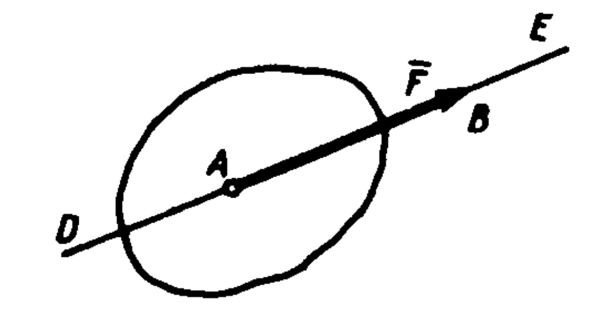

# Абсолютное твердое тело
*Статика* называется раздел механики, в котором излагается общее учение о силах и изучаются условия равновесия материальных тел, находящихся под действием сил.

Под равновесием будем понимать состояние покоя тела по отно­шению к другим телам, например по отношению к Земле. Условия равновесия тела существенно зависят от того, является ли это тело твердым, жидким или газообразным. Равновесие жидких и газообразных тел изучается в курсах гидростатики или аэростатики. В об­щем курсе механики рассматриваются обычно только задачи о рав­новесии твердых тел.

Все встречающиеся в природе твердые тела под влиянием внеш­них воздействий в той или иной мере изменяют свою форму (дефор­мируются). Величины этих деформаций зависят от материала тел, их геометрической формы и размеров и от действующих нагрузок. Для обеспечения прочности различных инженерных сооружений и конструкций материал и размеры их частей подбирают так, чтобы деформации при действующих нагрузках были достаточно малы. Вследствие этого при изучении условий равновесия вполне допусти­мо пренебрегать малыми - деформациями соответствующих твердых тел и рассматривать их как недеформируемые или абсолютно твер­дые. *Абсолютно твердым* телом называют такое тело, расстояние между каждыми двумя точками которого всегда остается постоян­ным. В дальнейшем при решении задач статики все тела рассматри­ваются как абсолютно твердые, хотя часто для краткости их назы­вают просто твердыми телами. 

Состояние равновесия или движения данного тела зависит от ха­рактера его механических взаимодействий с другими телами, т. е. от тех давлений, притяжений или отталкиваний, которые тело испы­тывает в результате этих взаимодействий. Величина, являющаяся основной мерой механического взаимодействия материальных тел, называется в механике *силой*. 

Рассматриваемые в механике величины можно разделить на ска­лярные, т. е. такие, которые полностью характеризуются их число­вым значением, и *векторные*, т. е. такие, которые помимо числового значения характеризуются еще и направлением в пространстве. 

Сила — величина векторная. Ее действие на тело определяется: 1) *числовым* значением или *модулем силы*, 2) *направлением силы*, 3) *точкой приложения силы*.

Модуль силы находят путем ее сравнения с силой, принятой за единицу. Основной единицей измерения силы в Международной сис­теме единиц (СИ), которой мы будем пользоваться (подробнее см. § 75), является 1 ньютон (1 Н); применяется и более крупная еди­ница 1 килоньютон (1 кН = 1000 Н). Для статического измерения силы служат известные из физики приборы, называемые *динамомет­рами*. 

Силу, как и все другие векторные величины, будем обозначать буквой с чертой над нею (например, F), а модуль силы — символом lFl или той же буквой, но без черты над нею (F). Графически сила, как и другие векторы, изображается направленным отрезком (рис. 1). Длина этого отрезка выражает в выбранном масштабе мо­дуль силы, направление отрезка соответствует направлению силы, точка А на рис. 1 является точкой приложения силы (силу можно изобразить и так, что точкой приложения будет конец силы, как f на рис. 4, в). Прямая DE, вдоль ко­торой направлена сила, называется *ли­нией действия силы*. Условимся еще о следующих определениях.

Рис.1
1. *Системой сил* будем называть сово­купность сил, действующих на рассмат­риваемое тело (или тела). Если линии действия всех сил лежат в одной плоскости, сил называется *плоской*, а если эти линии действия не лежат в одной плоскости,— *пространствен­ной*. Кроме того, силы, линии действия которых пересекаются в од­ной точке, называются *сходящимися*, а силы, линии действия кото­рых параллельны друг другу,— *параллельными*.
2. Тело, которому из данного положения можно сообщить Любое перемещение в пространстве, называется *свободным*.
3. Если одну систему сил, действующих на свободное твердое тело, можно заменить другой системой, не изменяя при этом состоя­ния покоя или движения, в котором находится тело, то такие две системы сил называются *эквивалентными*.
4. Система сил, под действием которой свободное твердое тело 10 может находиться в покое, называется *уравновешенной* или *экви­валентной нулю*.
5. Если данная система сил эквивалентна одной силе, то эта сила называется *равнодействующей* данной системы сил. Сила, равная равнодействующей по модулю, прямо противопо­ложная ей по направлению и действующая вдоль той же прямой, на­зывается *уравновешивающей* силой.
6. Силы, действующие на данное тело (или систему тел), можно разделить на внешние и внутренние. *Внешними* называются силы, которые действуют на это тело (или на тела системы) со стороны дру­гих тел, а *внутренними* — силы, с которыми части данного тела (или тела данной системы) действуют друг на друга.
7. Сила, приложенная к телу в какой-нибудь одной его точке, называется *сосредоточенной*. Силы, действующие на все точки дан­ного объема или данной части поверхности тела, называются *распре­деленными*.

Понятие о сосредоточенной силе является условным, так как практически приложить силу к телу в одной точке нельзя. Силы, которые в механике рассматривают как сосредоточенные, представля­ют собой по существу равнодействующие некоторых систем распре­деленных сил.

В частности, рассматриваемая в механике сила тяжести, дейст­вующая на данное твердое тело, представляет собой равнодейст­вующую сил тяжести, действующих на его частицы. Линия действия этой равнодействующей проходит через точку, называемую *центром тяжести тела*.

Задачами статики являются: 1) преобразование систем сил, дей­ствующих на твердое тело, в системы им эквивалентные, в частно­сти приведение данной системы сил к простейшему виду; 2) опреде­ление условий равновесия систем сил, действующих на твердое тело. 

Решать задачи статики можно или путем соответствующих геометрических построений (геометрический и графический методы), или с помощью численных расчетов (аналитический метод). В курсе будет главным образом применяться аналитический метод, однако следует иметь в виду, что наглядные геометрические построения иг­рают при решении задач механики чрезвычайно важную роль.
