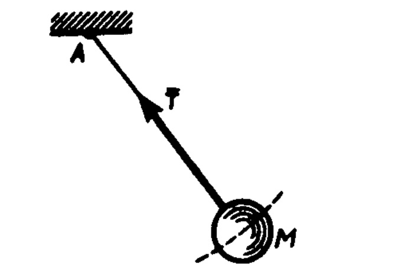
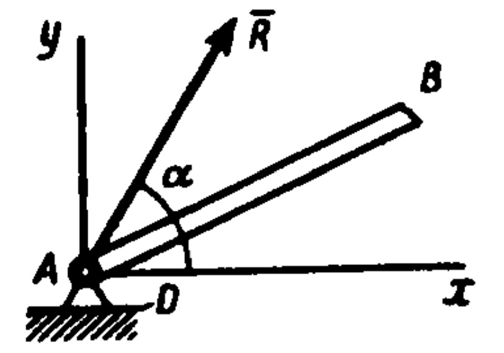
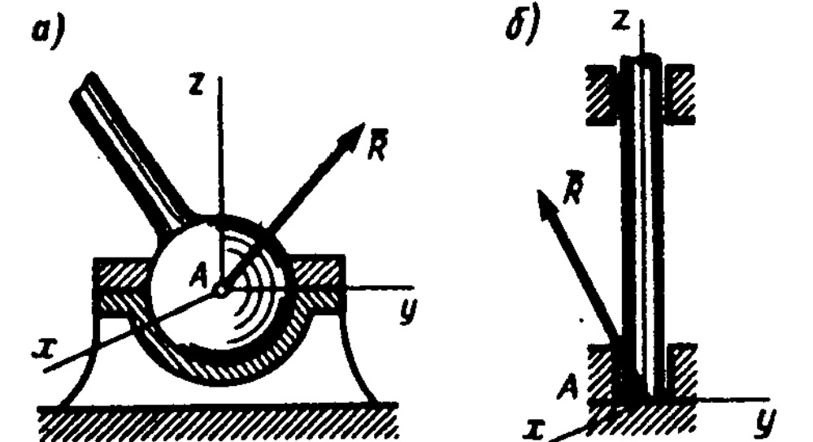

# Связи и их реакции
По определению, тело, которое может совершать из данного по­ложения любые перемещения в пространство, называется *свободным* (например, воздушный шар в воздухе). Тело, перемещениям кото­рого в пространстве препятствуют какие-нибудь другие, скрепленные или соприкасающиеся с ним, тела, называется *несвободным.
Все то, что ограничивает перемещения данного тела в пространстве, называют связью.* В дальнейшем будем рассматривать связи, реали­зуемые какими-нибудь телами, и называть связями сами эти тела. 

Примерами несвободных тел являются груз, лежащий на столе, дверь, подвешенная на петлях, и т, п. Связями в этих случаях будут: для груза — плоскость стола, не дающая грузу перемещаться по вертикали вниз; для двери — петли, не дающие двери отойти от косяка. 

Тело, стремясь под действием приложенных сил осуществить перемещение, которому препятствует связь, будет действовать на нее с некоторой силой, называемой *силой давления на связь.* Одновремен­но по закону о равенстве действия и противодействия связь будет действовать на тело с такой же по модулю, но противоположно на­правленной силой. *Сила, с которой данная связь действует на тело, препятствуя тем или иным его перемещениям, называется силой реакции (противодействия) связи или просто реакцией связи.* 

Значение реакции связи зависит от других действующих сил и наперед неизвестно (если никакие другие силы на тело не действуют, реакции равны нулю); для ее определения надо решить соответству­ющую задачу механики. *Направлена реакция связи в сторону, про­тивоположную той, куда связь не дает перемещаться телу.* Когда связь может препятствовать перемещениям тела по нескольким на­правлениям, направление реакции такой связи тоже наперед неиз­вестно и должно определяться в результате решения рассматривае­мой задачи. 
.jpg)
Рис.8

Рис.9
Правильное определение направлений реакций связей играет при решении задач механики очень важную роль. Рассмотрим по­этому подробнее, как направлены реакции некоторых основных
видов связей (дополнительные примеры приведены в § 17).
1. ***Гладкая плоскость (поверхность) или опора.***
Гладкой будем называть поверхность, трением о которую
данного тела можно в первом приближении пренебречь. Такая поверхность не дает телу перемещаться только по направлению общего перпендикуляра (нормали) к поверхностям соприкасающих­ся тел в точке их касания (рис. 8,а).Поэтому реакция $\vec N$ гладкой поверхности или опоры направлена по общей нормали к поверхно­стям соприкасающихся тел в точке их касания и приложена в этой точке. Когда одна из соприкасающихся поверхностей является точ­кой (рис. 8, б), то реакция направлена по нормали к другой поверх­ности.
2. ***Нить.***
Связь, осуществленная в виде гибкой нерастяжимой нити (рис. 9), не дает телу М удаляться от точки подвеса нити по направлению AM. *Поэтому реакция $\vec Т$ натя­нутой нити направлена вдоль нити к точке ее подвеса.*

Рис.10
3. ***Цилиндрический шарнир***
(подшипник). Цилиндрический шар­нир (или просто шарнир) осуществляет такое соединение двух тел, при котором одно те­ло может вращаться по отношению к другому вокруг общей оси, называемой *осью шарнира* (например, как две половины ножниц). Если тело А В прикреплено с помощью такого шарнира к неподвижной опоре D (рис. 10), то точка А тела не может при этом переместиться ни по какому на­ правлению, перпендикулярному оси шарнира. Следовательно, *ре­акция $\vec R$ цилиндрического шарнира может иметь любое направление в плоскости перпендикулярной оси шарнира, т. е. в плоскости Аху.* Для силы R в этом случае наперед неизвестны ни ее модуль R, ни направление.
4. ***Сферический шарнир и подпятник.***
Тела, соединенные сферическим шарниром, могут как угодно поворачиваться одно относительно другого вокруг центра шарнира. Приме­ром служит прикрепление фотоаппарата к штативу с помощью шаровой пяты. Если тело прикреплено с помощью такого шарнира к неподвижной опоре (рис. И, а), то точка А тела, совпадающая с центром шарнира, не может при этом совершить никакого пере­мещения в пространстве. Следовательно, *реакция $\vec R$ сферического шарнира может иметь любое направление в пространстве.* Для нее наперед неизвестны ни ее модуль R, ни углы с осями Aхуz.
Произвольное направ­ление в пространстве мо­жет иметь и реакция R подпятника
(под­шипника с упором), изо­браженного на рис. 11,6.
5. ***Невесомый стержень.***
Невесо­мым называют стержень, весом которого по сравнению с воспринимаемой им нагрузкой можно пренебречь. Пусть для какого-нибудь находящегося в равно­весии тела (конструкции) такой стержень, прикрепленный в точках А и В шарнирами, является связью (рис. 12,а). Тогда на стержень будут действовать только две силы, приложенные в точках
А и В; при равновесии эти силы должны быть направлены вдоль одной
прямой, т. е. вдоль АВ (см. рис. 4, а, в). Но тогда согласно закону о действии и противодействии стержень будет действовать на тело с силой, тоже направленной вдоль АВ. Следовательно ,*реакция $\vec N$ невесомого шарнирно прикрепленного прямолинейного стержня на­правлена вдоль оси стержня.*

Рис.11
