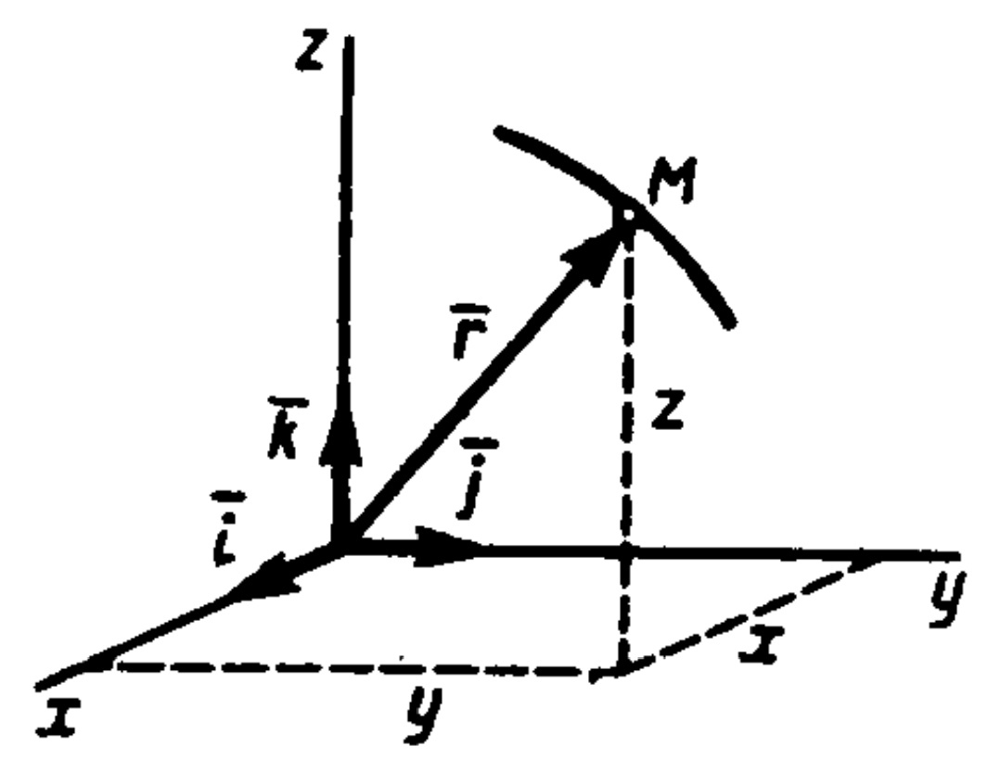
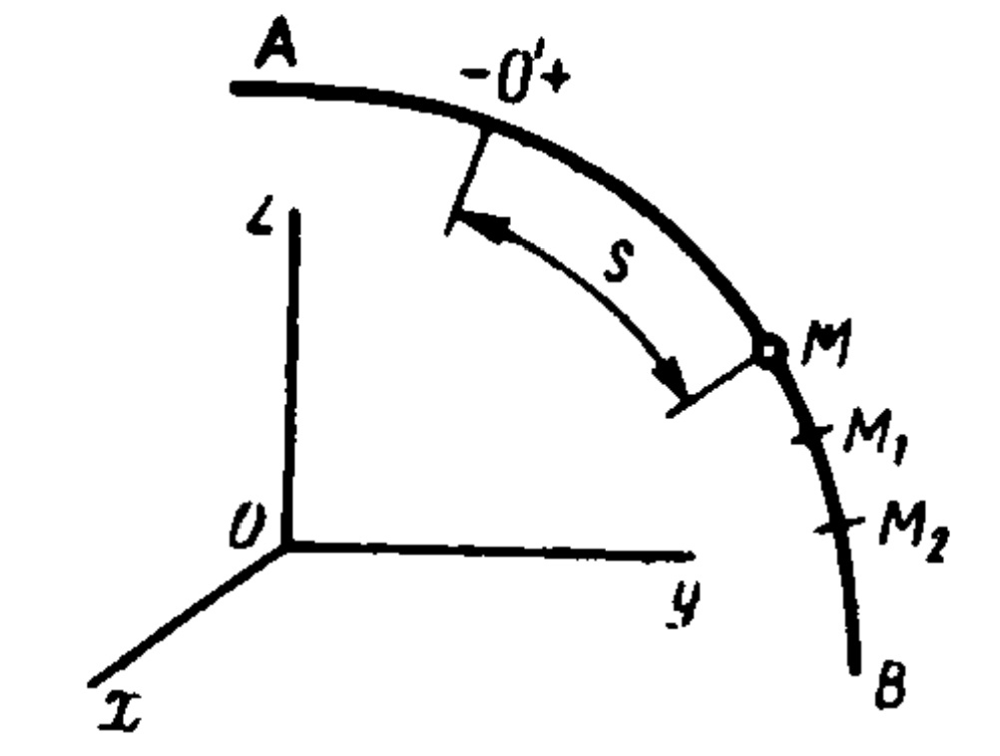

# Способы задание движение точки
Для задания движения точки можно применять один из следую­щих трех способов: 1) векторный,2) координатный, 3) естественный.

1 . ***Векторный способ задания движения точки.*** Пусть точка М движется по отношению к некоторой си­стеме отсчет Охуz. Положение этой точки в любой момент времени можно определить', задав ее радиус-вектор r, проведенный из на­чала координат О в точку М (рис.114). 

При движении точки М вектор r будет с течением времени изме­няться и по модулю, и по направлению. Следовательно r, является переменным вектором (вектором-функцией), зависящим от аргу­мента t :

$$r=r(t)$$
(1)
Равенство (1) и определяет закон движения точки в векторной форме, так как оно позволяет в любой момент времени построить соответствующий вектор r и найти положение движущейся точки. 

Геометрическое место концов вектора r, т. е. годограф этого век­тора, определяет траекторию движущейся точки. 

Аналитически, как известно, вектор задается его проекциями на координатные оси. В прямоугольных декартовых координатах для вектора r будет: $r_х—х$, $z_у—у$, $r_z=z$ (см. рис. 114), где х, у, z — де­картовы координаты точки. Тогда, если ввести единичные векторы (орты) i, j, k координатных осей, получим для r
выра­жение 

рис.114

$$r = xi + yj + zk$$
(2)

Следовательно, зависимость (1) r от t будет известна, если будут заданы коор­динаты х, у, z точки как функции времени. Такой способ задания движения точки (Рис. 114) (координатный) рассмотрим ниже. Век­тор может быть задан, как известно, и иными способами, например его модулем я углами с осями или проекциями на оси других систем координат. Для получения общих формул, независящих оттого, как конкретно задан вектор r, будем исходить из векторного закона дви­жения, представленного равенством (1).

2 . ***Координатный способ задания движе­ния точки.*** Положение точки можно непосредственно определяет ее декартовыми координатами х, у, z, которые при движении точки будут с течением времени изменяться. Чтобы знать закон дви­жения точки, т. е. ее положение в пространстве в любой момент вре­мени, надо знать значения координат точки для каждого момента времени, т. е. знать зависимости 

$$x=f_1(t),  y=f_2(t),  z=f_3(t)$$  
(3)

Уравнения (3) представляют собой *уравнения движения точки в прямоугольных декартовых координатах*. Они определяют закон движения точки при координатном способе задания движения. 
Если движение точки происходит все время в одной и той же плоскости, то, приняв эту плоскость за плоскость Оху, получим в этом случае два уравнения движения: 

$$x=f_1(t), y=f_2(t)$$(4) 

Наконец, при прямолинейном движении точки, если вдоль ее траектории направить координатную ось Ох, движение будет опре­деляться одним уравнением (*законом прямолинейного движения точки*) 
$$x=f(t)$$
(5) 

Уравнения (3) и (4) представляю собой одновременно уравне­ния траектории точки в параметрической форме, где роль параметра играет врем t. Исключив из уравнений движения время t, можно найти уравнение траектории в обычной форме, т. е. в виде, дающем зависим ость между координатами точки. 

Пример. Пусть движение точки в плоскости Оху дано уравнениями:

$$x=2t, у= 12t^2$$
(а)

где Xt у выражены в сантиметрах; t— в секундах. 

По этим уравнениям можно найти, что в момент времени $t= 0$ точка находится в положении $М_0 (0, 0)$, т. е. в начале координат, в момент $t_1=1с$ — в положении $M_0 (2,12)$ и т. д. Таким образом, уравнения (а) действительно определяют положе­ние точки в любой момент времени. Давая t разные значения и изображая соот­ветствующее положения точки на рисунке, можем построить ее траекторию.

Другим путем траекторию можно найти, исключу t из уравнений (а). Из первого уравнения находим $t=\frac {x}{2}$ и, подставляя это значение во второе уравнение, получаем $у=3х^2$. Следовательно, траекторией- точки является парабола с вершиной в начале координат и осью, параллельной оси Оу. Другие примеры определения траектории точки см. в §41.

3 . ***Естественный способ задания движение точки***. 

Рис.115
Естественным (или траекторным) способом задания движения удобно пользоваться в тех слу­чаях, когда траектория движущейся точки известна заранее. Пусть кривая АВ явля­ется траекторией точки М при ее движении относительно системы отсчета Охуz (рис.115). Выберем на этой траектории какую-нибудь неподвижную точку О', которую примем за начало отсчета, и установим на траектории положительное и отрицательное направления отсчета (как на координат­ной оси). Тогда положение точки М на тра­ектории будет однозначно определяться криволинейной коорди­натой s, которая равна расстоянию от точки О’ до точки М измеренному вдоль дуги траектории и взятому с соответствующим зна­ком. При движении точка М перемещается в положения $М_1, М_2...,$следовательно, расстояние s будет с течением времени изменяться. Чтобы знать положение точки М на траектории в любой момент вре­мени, надо знать зависимость

$$s=f(t)$$(6)

Уравнение (6) и выражает *закон движения точки* М вдоль тра­ектории. 

Таким образам, чтобы задать движение точки естественным спо­собом, надо задать: 1) траекторию точки; 2) начало отсчета на траек­тории с указанием положительного и отрицательного направлений отсчета; 3) закон движения точки вдоль траектории в виде $s=f(t)$. 

Заметим, что величина s в уравнении (6) определяет положение движущейся точки, а не пройденный ею путь. Например, если точ­ка, двигаясь из начала О', доходит до положения М, (рис. 115), а затем, перемещаясь в обратном направлении, приходит в положе­ние М, то в этот момент ее координата $s=0'M$ а пройденный за время движения путь будет равен $0'M_1+M_1M$, т. е. не равен.