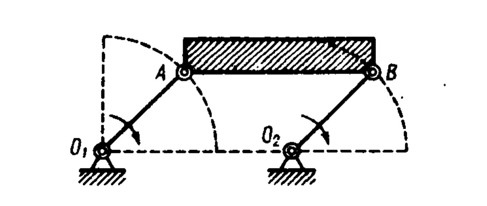
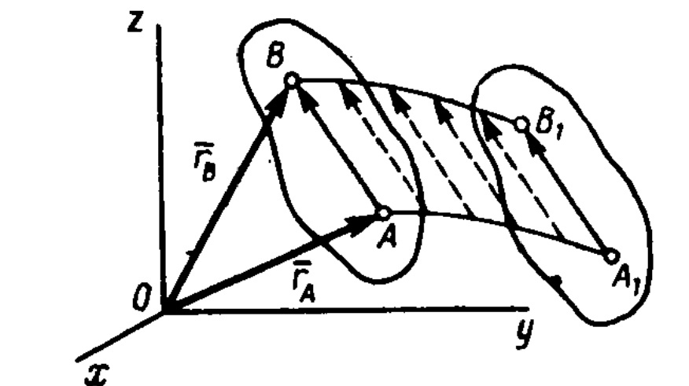
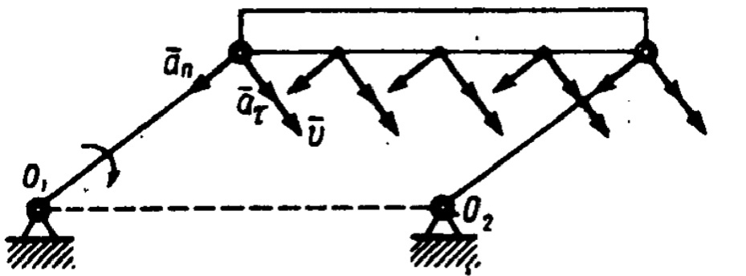

# Поступательное движение
В кинематике, как и в статике, будем рассматривать все твердые
тела как абсолютно твердые. Задачи кинематики твердого тела рас­падаются на две части:
1 ) задание движения и определение кинематических характе­ристик движения тела в целом; 2) определение кинематических характеристик движения отдельных точек тела.

Начнем с рассмотрения поступательного движения твердого тела.

*Поступательным называется такое движение твердого тела, при котором любая прямая, проведенная в этом теле, перемещается, оставаясь параллельной своему начальному направлению.* 

Поступательное движение не следует смешивать с прямолиней­ным. При поступательном движении тела траектории его точек мо­гут быть любыми кривыми линиями. Приведем примеры.
1. Кузов автомобиля на прямом горизонтальном участке дороги движется поступательно. При этом траектории его точек будут пря­мыми линиями.
2. Спарник АВ (рис. 131) при вращении кривошипов $O_1A$ и $O_2B$ $(O_1A=O_2B)$ также движется поступательно (любая проведенная в нем прямая остается параллельной ее начальному направлению).Точки спарника движутся при этом по окружностям.

Рис.131

Рис.132

*Свойства поступательного движения определяются следующей теоремой: при поступательном движении все точки тела описывают одинаковые (при наложении совпадающие) траектории и имеют в каждый момент времени одинаковые по модулю и направлению ско­рости и ускорения.* 

Для доказательства рассмотрим твердое тело, совершающее по­ступательное движение относительно системы отсчета Охуz.
Возьмем в теле две произвольные точки А и В, положения которых в момент времени t определяются радиусами-векторами $\vec r_А$ и $\vec r_В$ (рис. 132);
проведем вектор $\vec {АВ}$, соединяющий эти точки. Тогда 

$$\vec r_В = \vec r_А+\vec {АВ}$$(35)

При этом длина АВ постоянна, как расстояние между точками твердого тела, а направление $\vec {АВ}$ остается неизменным, так как тело движется поступательно. Таким образом, вектор $\vec {АВ}$ во все время движения тела остается постоянным ($\vec {АВ}$=const). Вследствие этого, как видно из равенства (35) (и непосредственно из чертежа), траектория точки В получается из траектории точки А параллель­ным смещением всех ее точек на постоянный вектор $\vec {АВ}$.
Следова­тельно, траектории точек А и В будут действительно одинаковыми (при наложении совпадающими) кривыми. 

Для нахождения скоростей точек А и В продифференцируем обе части равенства (35) по времени. Получим

$$\frac {d\vec r_B}{dt} = \frac {d\vec r_A}{dt}+\frac{d(\vec {AB})}{dt}$$ 

Но производная от постоянного вектора $\vec {АВ}$ равна нулю. Про­изводные же от векторов $\vec r_A$ и $\vec r_В$ по времени дают скорости точек $А \parallel В$.
В результате находим, что
$$ \vec\upsilon_A=\vec\upsilon_B$$

т. е. что скорости точек А и В тела в любой момент времени оди­наковы и по модулю, и по направлению. Беря от обеих частей полученного равенства производные по времени, найдем:

$$\frac{d\vec v_A}{dt} = \frac{d\vec v_B}{dt}$$
или
$$\vec a_A=\vec a_B$$
Следовательно, ускорения точек А и В тела в любой момент времени тоже одинаковы по модулю и направлению. 

Так как точки А и В были выбраны произвольно, то из найден­ных результатов следует, что у всех точек тела их траектории, а также скорости и ускоре­ния в любой момент време­ни будут одинаковы. Таким образом, теорема доказана. 

Скорости и ускорения точек движущегося тела образуют векторные поле нулей скоростей и поле ускорений точек тела. 

Рис.133

Из доказанного следует, что поля скоростей и ускорений точек
тела, движущегося поступательно, будут однородными (рис. 133), но вообще не стационарными, т. е. изменяющимися во Времени (см.32). 

Из теоремы следует также, что поступательное движение твердого тела вполне определяется движением какой-нибудь одной его точки. Следовательно, изучение поступательного движения тела: водится к задаче кинематики точки, нами уже рассмотренной.

При поступательном движении общую для всех точек тела ско­рость $\vec v$ называют *скоростью поступательного движения* тела, а ускорение $\vec а$ — ускорением поступательного движения* Векторы $\vec v$ и $\vec а$ можно изображать приложенными к любой точке тела.

Заметим, что понятия о скорости и ускорении тела имеют смысл поскольку *при поступательном движении*. Во всех остальных случаях точки тела, как мы увидим, движутся с разными скоростями и ускорениями, и термины «скорость тела» или «ускорение тела» для этих движений теряют смысл
