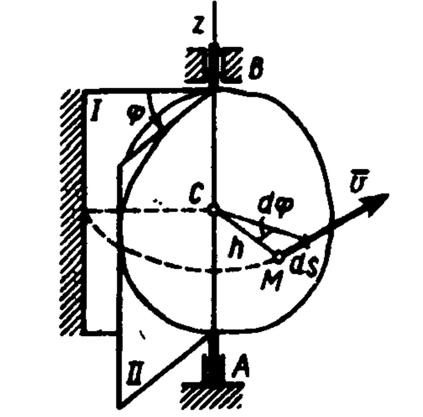
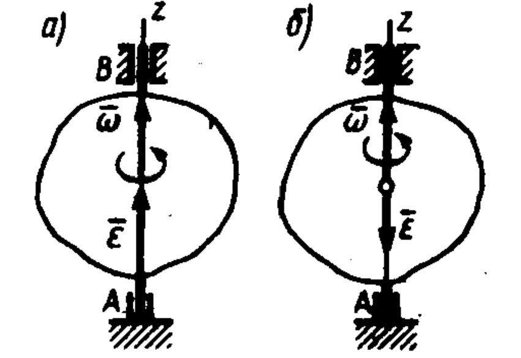

# Вращательное движение твердого тела
*Вращательным движением твердого тела вокруг неподвижной оси называется такое его движение, при котором какие-нибудь две точки, принадлежащие телу (или неизменно с ним связанные), остаются во все время движения неподвижными*(рис. 134). Проходящая через неподвижные точки А и В прямая А В называется осью вращения.

Так как расстояния между точками твердого тела .должны оста­ваться неизменными, то очевидно, что при вращательном движении все точки, принадлежащие оси вращения,
будут неподвижны, а все остальные точки тела будут описывать окружности; плоско­сти которых перпендикулярны оси враще­ния, а центры лежат на этой оси.

Рис.134

Для определения положения вращаю­щегося тела проведем через *ось вращения*,
вдоль которой направим ось Az, полуплос­кость — неподвижную и полуплоскость, врезанную в само тело и вращающую­ся вместе с ним (см. рис. 134). Тогда поло­жение тела в любой момент времени одно­значно определится взятым с соответствую­щим знаком углом $\varphi$ между этими полуплоскостями, который назо­вем *углом поворота* тела.
Будем считать угол $\varphi$ положительным, если он отложен от неподвижной плоскости в направлении против хода часовой стрелки (для наблюдателя, смотрящего с положительного конца оси Az, и отрицательным, если по ходу часовой стрелки.
Измерять угол $\varphi$ будем *всегда в радианах*. Чтобы знать положение тела в любой момент времени, надо знать зависимость угла $\varphi$ от времени t, т. е.

$$\varphi=f(t)$$ (36)

Уравнение (36) выражает *закон вращательного движения твер­дого тела вокруг неподвижной оси*. 

Основными кинематическими характеристиками вращательного движения твердого тела являются его угловая скорость $\omega$ и углевое ускорение $\varepsilon$.

Если за промежуток времени $\Delta t=t_1—t$ тело совершает поворот на угол $\Delta\varphi =\varphi_1—\varphi$, то численно средней угловой скоростью тела за этот промежуток времени будет $\omega_ср=\frac {\Delta\varphi}{\Delta t}$. В пределе при $\Delta t \to 0$ найдем, что

$$\omega=\frac {d\varphi}{dt}$$
или 
$$\omega=\varphi'$$
(37) 

Таким образом, *числовое значение угловой скорости тела в данный момент времени равно первой производной от угла поворота по времени.* Равенство (37) показывает также,  что величина о равна отношению элементарного угла поворота $d\varphi$ к соответствующему промежутку времени $dt$.Знак со определяет направление вращения $\omega$ Легко видеть, что когда вращение происходит против хода стрелки, а когда по ходу часовой стрелки, то $\omega<0$.

Размерность угловой скорости $\frac 1t$(т. е. 1/время); в качестве единицы измерения обычно применяют рад/с или, что то же, 1/с ($с^{-1}$), как радиан — величина безразмерная

Угловую скорость тела можно изобразить в виде вектора $\vec \omega$, модуль и который равен $|\omega|$ и направлен вдоль оси вращения тела в ту сторону, откуда
вращение видно происходящим против часовой стрелки (рис. 135). Такой вектор определяет сразу и модуль угловой скорости, и ось вращения, и направление вращения вокруг этой оси.

***Угловое ускорение*** характеризует изменение с течением времени угловой скорости тела. Если за промежуток времени $\Delta t=t_1—t$ угловая скорость тела изменяется на величину $\Delta\omega =\omega_1—\omega$, то числовое значение среднего углового ускорения тела, а этот промежуток времени будет $\varepsilon_ср=\frac {\Delta\omega}{\Delta t}$ . В пределе при $\Delta t \to 0$, учтя одновременно равенство (37), что 

Рис.135
$$\varepsilon=\frac {d\omega}{dt}=\frac{d^2\varphi}{dt^2}$$ или
$$\varepsilon=\omega'=\varphi"$$
(38)

*Таким образом, числовое значение углового ускорения тела в данный момент времени равно первой производной от угловой скорости или которой производной от угла поворота тела по времени.* 

Размерность углового ускорения ($1/время^2$); в качестве
единицы измерения обычно применяется $рад/с^2$ или, что то же, $1/сc^2$). 

Если модуль угловой скорости со временем возрастает, вращение
тела называется *ускоренным*, а если убывает,— замедленным. Легко идет, что вращение будет ускоренным, когда величины $\varepsilon$ и $\omega$ имеют одинаковые знаки, и *замедленным*,— когда разные.

Угловое ускорение тела (по аналогии с угловой скоростью) также изобразить в виде вектора $\vec \varepsilon$, направленного вдоль оси вращения. При этом
$$\vec \varepsilon=\frac{d\vec \omega}{dt}$$(38')

Направление $\vec \varepsilon$ совпадает с направлением $\vec \omega$, когда тело вращается
ускоренно (рис. 135, а), и противоположно $\vec \omega$ при замедленном вращении (рис. 135,б)